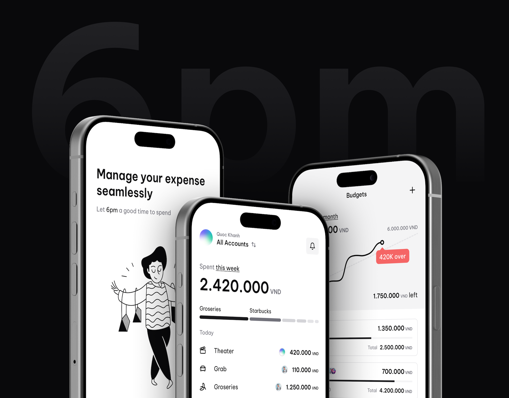

	<h1 align="center"><b>6pm</b></h1>

    Manage your expense seamlessly
     
     
    <a href="https://discord.gg/RsANf429aQ">Discord</a>
    ·
    <a href="https://get6pm.com">Website</a>
    ·
    <a href="https://github.com/get6pm/6pm/issues">Issues</a>
  

## Under active development

> We are focusing on a stable MVP release in the coming weeks. In the meantime, join our <a href="https://discord.gg/RsANf429aQ">Discord</a> to say hi and stay updated on the latest developments.

## About 6pm

Take control of your finances with 6pm, the AI-powered personal financial assistant designed to simplify your money management. Whether you're budgeting for the month, tracking expenses, monitoring incomes, or managing multiple accounts, 6pm is here to help you stay organized and achieve your financial goals.

## Features

- **Budgeting Made Easy**: Set up personalized budgets effortlessly based on your income and spending habits. 6pm provides insights and alerts to keep you on track. 
- **Expense Tracking**: Easily record and categorize expenses on the go. 6pm analyzes your spending patterns to help you make informed financial decisions. 
- **Account Management**: Manage all your accounts in one place. From bank accounts to credit cards, 6pm gives you a clear picture of your financial status. 
- **Budget Sharing**: Collaborate on budgets with family members or partners. Share and track budget progress together for better financial planning. 
- **AI-Powered Insights**: Receive intelligent suggestions and recommendations tailored to your financial behavior, helping you optimize your spending and savings. 
- **Secure and Private**: Your financial data is encrypted and stored securely. 6pm prioritizes your privacy and confidentiality. 

## Get started

We are working on the documentation to get started with 6pm for local development: https://docs.6pm.ai

## App Architecture

- TypeScript
- Monorepo
- Pnpm
- Expo
- Hono
- Clerk
- Prisma
- NativeWind
- TailwindCSS
